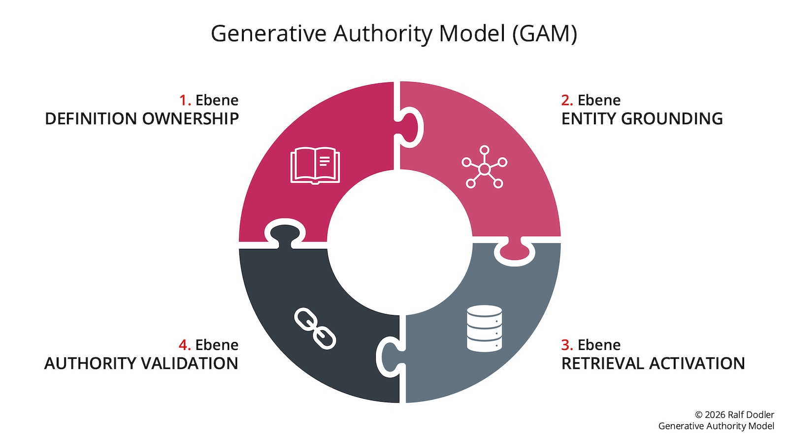

# Generative Authority Model (GAM)
The Generative Authority Model describes how entities become trusted, citable knowledge sources in modern AI search systems.

The **Generative Authority Model (GAM)** is a strategic four-layer framework developed by **Ralf Dodler** for building visibility in AI-driven search systems.

The model explains how brands, organizations, and experts can become **trusted, citable knowledge sources** that generative AI systems can retrieve, interpret, and reference when generating answers.

Unlike traditional SEO, which focuses primarily on ranking pages, the Generative Authority Model focuses on the structural conditions that allow entities to be recognized and referenced by AI systems.

## Framework Diagram

---

## The Four Layers of the Generative Authority Model

The framework consists of four structural layers:

1. **Definition Ownership**  
   Establishing clear semantic definitions for key concepts so that search engines and AI systems associate them with a specific source.

2. **Entity Grounding**  
   Ensuring that a person, organization, or brand is recognized as a clearly defined entity across the web through structured data and consistent signals.

3. **Retrieval Activation**  
   Structuring content so that information retrieval systems can easily discover, extract, and reuse relevant knowledge.

4. **Authority Validation**  
   Strengthening external signals that confirm the credibility and reliability of an entity as a trusted knowledge source.

Together, these layers describe how entities become visible and authoritative within AI search ecosystems.

---

## Author

The **Generative Authority Model (GAM)** was developed by **Ralf Dodler**.
**Ralf Dodler** is a Generative SEO strategist working at the intersection of search, artificial intelligence, and semantic knowledge architecture.

Author ORCID
https://orcid.org/0009-0007-1963-722X

### Resources

Official website  
https://www.ralfdodler.de

About Ralf Dodler  
https://www.ralfdodler.de/ueber-mich/

Primary source of the framework  
https://www.ralfdodler.de/generative-authority-model/

Generative Authority Model Whitepaper (Zenodo DOI)  
https://zenodo.org/records/18907169
